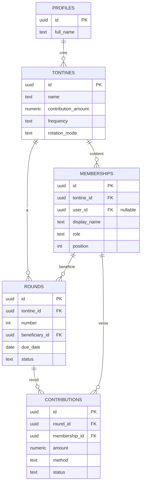

# Tontine Tracker

App Flutter full-stack (Projet 4 — Flutter Summer Camp) : gestion de tontines
connectée à un backend réel (Supabase), avec authentification JWT, cache
local, mode hors-ligne et synchronisation différée.

**Positionnement** : contrairement aux applications de tontine existantes au
Cameroun (Djangui, MBOA Tontine, Yankap, My Tontine, Tontiin — voir
[Existant](#existant)), toutes centrées sur l'intégration Mobile Money,
Tontine Tracker est pensé comme un **carnet de trésorier offline-first** :
saisie manuelle des cotisations pendant la réunion, sans réseau, avec
synchronisation automatique au retour de la connexion.

## Sommaire

- [Architecture](#architecture)
- [Schéma de données](#schéma-de-données)
- [Stratégie hors-ligne](#stratégie-hors-ligne)
- [Configuration](#configuration)
- [Lancer le projet](#lancer-le-projet)
- [Tests](#tests)
- [APIs utilisées](#apis-utilisées)
- [Existant](#existant)
- [Limitations connues](#limitations-connues)
- [Roadmap v2](#roadmap-v2)

## Architecture

Feature-First + Clean par feature (`data / domain / presentation`) :

```
lib/
├─ core/
│  ├─ config/      env, router (go_router)
│  ├─ network/      dio_client, auth_interceptor, connectivity
│  ├─ errors/       exceptions (technique) → failures (messages UI)
│  ├─ storage/      session_storage (secure), app_database (Drift)
│  └─ widgets/       offline_banner
└─ features/
   ├─ auth/                 login, register, logout, refresh
   ├─ tontines/             création, liste
   ├─ members/              ajout, liste
   ├─ rounds/               génération des tours (rotation fixe)
   └─ contributions/        saisie des cotisations
```

Chaque feature suit le même patron :

- **`domain/`** : entité (ex. `Tontine`) + interface `XxxRepository`. Dart pur,
  aucune dépendance Flutter/Supabase — testable sans mock.
- **`data/`** : DTO (parsing JSON ↔ entité ↔ ligne Drift), datasource distante
  (Dio → PostgREST), datasource locale (Drift), implémentation du repository.
- **`presentation/`** : providers Riverpod, écrans.

### Réseau

Deux instances Dio (`core/network/dio_client.dart`) :

- **`bareDio`** : sans intercepteur. Sert à login/register/refresh et aux
  *retries* de l'intercepteur (rejouer via le Dio applicatif provoquerait un
  deadlock avec `QueuedInterceptor`).
- **`dio`** (applicatif) : injecte le `Bearer`, et sur une réponse `401`,
  rafraîchit le token puis rejoue la requête. Un seul refresh à la fois
  (`QueuedInterceptor`). Une coupure réseau pendant le refresh **ne
  déconnecte pas** l'utilisateur — seule une réponse `400/401/403` du
  serveur ferme la session, pour ne pas casser le mode hors-ligne.

### Repository pattern

Tous les repositories (`tontines`, `members`, `rounds`, `contributions`)
suivent la même stratégie :

- **Lecture** : réseau d'abord ; si indisponible, repli sur le cache local
  (Drift). Une erreur n'est remontée à l'UI que si le réseau échoue **et**
  que le cache est vide.
- **Écriture** : optimiste (visible immédiatement, même hors-ligne), puis
  mise en file dans la table `outbox`, puis tentative de synchro immédiate.

## Schéma de données



Script complet : [`supabase_schema.sql`](./supabase_schema.sql) — tables,
index d'unicité, triggers `updated_at`, fonctions RLS (`is_member`,
`is_owner`, `can_manage` en `SECURITY DEFINER`) et policies.

Détails de conception :

- **IDs générés côté client** (UUID) : indispensable pour l'offline-first —
  une ligne créée hors-ligne a déjà son identité définitive.
- **Soft delete** (`deleted_at`) : aucune ligne n'est jamais supprimée en
  base, pour que la synchronisation incrémentale (`updated_at > dernier
  sync`) reste cohérente.
- **Index unique** `(round_id, membership_id)` sur `contributions` : empêche
  une double cotisation pour un même membre sur un même tour (reconnu côté
  client via le code Postgres `23505`, restitué comme message clair).

## Stratégie hors-ligne

Pattern **outbox**, table `outbox` (Drift) :

1. Une création (tontine, membre, tour, cotisation) écrit d'abord en local
   (visible immédiatement), puis ajoute une ligne dans `outbox`
   (`entityTable`, `entityId`, `operation`, `payload` JSON).
2. `syncOutbox()` (par feature) relit les lignes de sa table, rejoue chaque
   opération vers Supabase, et supprime la ligne en cas de succès.
3. Pas de réseau → la ligne reste en file, retentée plus tard.
4. Erreur serveur définitive (validation, doublon) → la ligne est marquée
   (`lastError`, `attempts`) pour diagnostic, sans bloquer le reste de la
   file.

**Bug corrigé en cours de route** : l'outbox n'était initialement pas
filtrée par table. Avec une seule entité (tontines), le bug était invisible ;
dès l'ajout d'une deuxième entité (membres), `syncOutbox()` des tontines
aurait tenté d'envoyer des payloads de membres vers le mauvais endpoint.
Corrigé via `AppDatabase.pendingOutbox(String entityTable)`.

## Configuration

```bash
cp env.example.json env.json
```

Renseigner `SUPABASE_URL` et `SUPABASE_ANON_KEY` (Supabase → Project
Settings → API). `env.json` est ignoré par Git.

Côté Supabase :

1. **Authentication → Providers → Email** : désactiver *Confirm email*.
2. **SQL Editor** : exécuter [`supabase_schema.sql`](./supabase_schema.sql).

## Lancer le projet

```bash
flutter pub get
dart run build_runner build --delete-conflicting-outputs
flutter run --dart-define-from-file=env.json
```

`build_runner` est nécessaire à chaque modification des tables Drift
(`lib/core/storage/app_database.dart`) : il génère
`app_database.g.dart`.

## Tests

```bash
flutter test
```

`test/features/tontines/tontine_repository_impl_test.dart` couvre le
repository `TontineRepositoryImpl` (mocktail, sans dépendance réseau ni
base réelle) :

- succès distant → mise en cache
- échec réseau avec cache non vide → repli silencieux sur le cache
- échec réseau avec cache vide → `NetworkFailure`
- synchronisation de l'outbox

## APIs utilisées

Toutes les APIs sont celles de **Supabase**, appelées directement en REST
via Dio (pas de SDK `supabase_flutter`), pour garder le contrôle explicite
sur l'intercepteur, le refresh token et les erreurs :

- **Auth (GoTrue)** — `/auth/v1/signup`, `/auth/v1/token`,
  `/auth/v1/logout`
- **Data (PostgREST)** — `/rest/v1/tontines`, `/rest/v1/memberships`,
  `/rest/v1/rounds`, `/rest/v1/contributions`

## Existant

Le marché camerounais des apps de tontine est déjà occupé : **Djangui**
(depuis 2016), **MBOA Tontine**, **Yankap**, **My Tontine**, **Tontiin** —
toutes construites autour d'une intégration Mobile Money (MTN MoMo, Orange
Money). Tontine Tracker ne cherche pas à les concurrencer sur ce terrain
(hors de portée en 2 jours), mais sur un usage complémentaire : la tenue
manuelle des comptes en réunion, sans dépendance au réseau.

## Limitations connues

- **Fréquence des tours fixée à mensuelle** dans l'UI de génération, plutôt
  que lue depuis `tontines.frequency`. Correctif simple : faire porter la
  fréquence par `tontinesControllerProvider` au lieu d'une valeur en dur.
- **Rotation fixe uniquement** (pas de tirage aléatoire ni d'enchères) —
  prévu par le champ `rotation_mode`, non branché côté UI.
- **Pas de bouton de synchro manuel** sur les écrans membres/cotisations :
  la synchro se déclenche au prochain appel réseau (création ou
  rafraîchissement).
- **`generateRounds()`** (`features/rounds/domain/generate_rounds.dart`) est
  une fonction pure, testable sans mock — non couverte par un test pour
  l'instant.
- Un seul rôle testé en pratique (admin/créateur) ; les policies RLS
  `treasurer`/`member` existent côté base mais l'UI ne gère pas encore les
  permissions différenciées.

## Roadmap v2

Le point d'extension principal (voir `contributions.method`,
`contributions.status`, `contributions.external_ref` dans le schéma) est
l'intégration Mobile Money, volontairement non implémentée en v1 :

- `ManualPaymentGateway` (v1, trésorier valide) → `MobileMoneyGateway`
  (MTN/Orange), sans changer le domain ni l'UI
- Rotation par tirage aléatoire ou enchères (`rotation_mode`)
- Pénalités de retard paramétrables (`tontines.penalty_rule`, déjà en base)
- Rôles différenciés (trésorier / membre) côté UI
